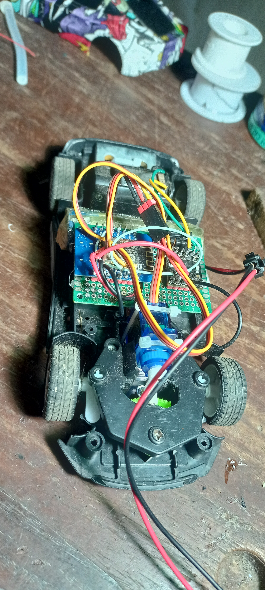
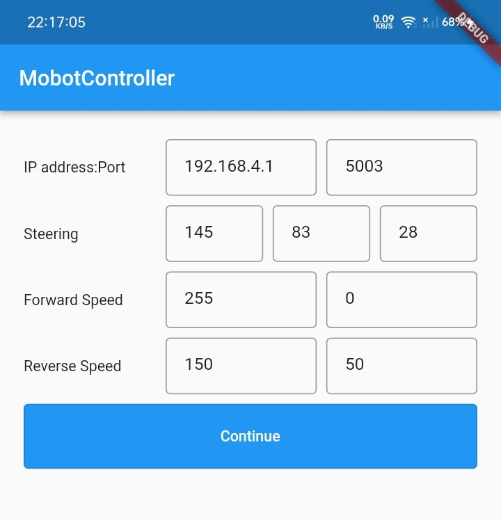
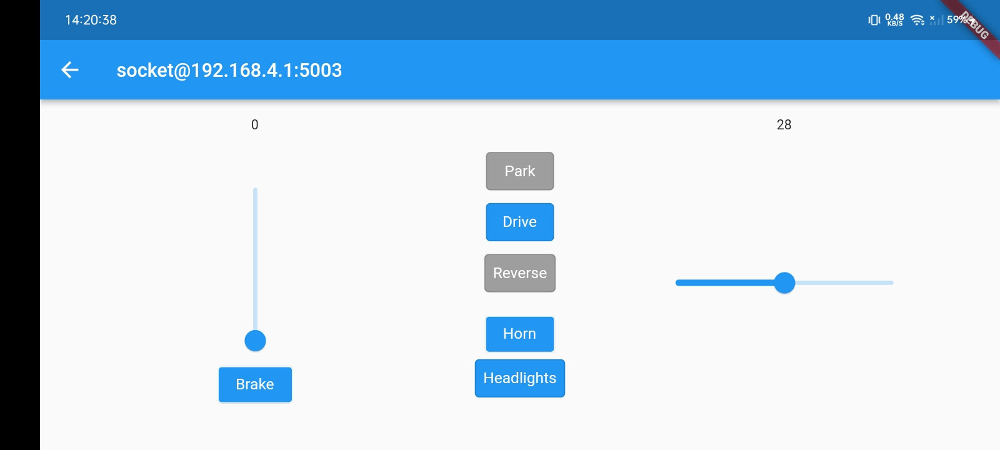

# MobotController

A remote controller app for an RC car built using Arduino on a **Lolin D1 Mini ESP8266** development board. It uses **Wi-Fi** for connectivity and **UDP** for communication. The app includes input fields for various parameters to allow fine-tuning of the RC mobot's behavior.

## The RC Mobot

At the core of the mobot is a **Lolin D1 Mini**. The car features:

- **SG90 servo** for steering
- **DRV8833 motor driver** for driving the DC motors (with coasting and braking features)
- **LEDs** for headlights and reverse lights\*
- An **active buzzer** for the horn\*

\*_Not added yet._

Arduino sketch can be found [here](https://github.com/CarterSnich/arduino-sketches/tree/master/esp8266-rc-car).

## Tuning

The app provides a tuning page where you can configure:

- Maximum, minimum, and center values for the **servo**
- Maximum and minimum **PWM values** to limit forward and reverse speed
- **IP address and port** for communication

All values are saved locally and automatically restored the next time the app is launched.

## Controller Interface

The controller interface is designed to mimic the controls of a real automatic vehicle:

- **Toggles** for Park, Drive, and Reverse
- **Buttons** for Horn and Headlights
- **Sliders** for Acceleration and Steering
- A **Brake button**
